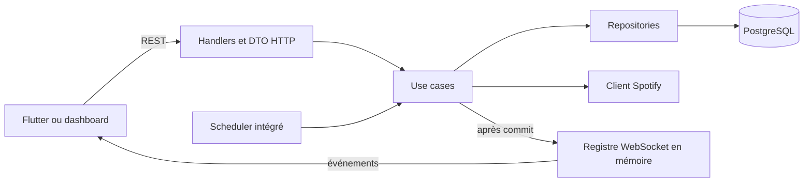
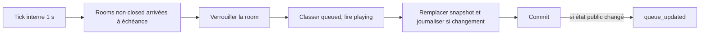

# Architecture du backend

Ce document décrit le backend implémenté. Voir [API REST](api.md), [WebSocket](websocket.md) et [schéma PostgreSQL](database.md) pour les contrats détaillés.

## Modules et flux

| Dossier                    | Rôle                                                                             |
| -------------------------- | -------------------------------------------------------------------------------- |
| `cmd/api`                  | Point d'entrée, serveur et arrêt du processus.                                   |
| `internal/app`             | Configuration, bootstrap, router et injection des dépendances.                   |
| `internal/domain`          | Entités et interfaces métier, distinctes des JSON publics.                       |
| `internal/usecase`         | Règles et transactions métier.                                                   |
| `internal/infra/http`      | Handlers, middlewares, validation du transport et DTO publics.                   |
| `internal/infra/db`        | Pool pgx, transaction, migration initiale et repositories SQL.                   |
| `internal/infra/spotify`   | Client Spotify avec délai HTTP de 10 s ; catalogue local si credentials absents. |
| `internal/infra/scheduler` | Recalcul périodique des files.                                                   |
| `internal/infra/ws`        | Connexions, hubs par room et diffusion temps réel.                               |
| `migrations`               | Schéma PostgreSQL exécuté par `AUTO_MIGRATE`.                                    |

Le WebSocket est en mémoire. Le MVP suppose **une seule instance API pour diffuser les événements** ; PostgreSQL demeure la source persistante. `room_events` est un journal DB léger, pas une source de replay WebSocket ni un système d'event sourcing.

## Sessions, rooms et QR

Une ligne `user_sessions` reste attachée à une seule room pour préserver ses votes et propositions. Un rejoin dans la même room réactive cette ligne et conserve son token. Avec un token connu d'une autre room, une transaction marque l'ancienne session `left` et crée une nouvelle session et un nouveau token. Après commit, les anciennes connexions WebSocket sont fermées et les compteurs de présence des deux rooms sont diffusés. Un token inconnu est ignoré et remplacé par un token généré serveur.

Le join vérifie un QR non expiré et non révoqué, puis verrouille et revérifie la room : seul le statut `active` accepte un join, une proposition ou un vote. Une rotation QR verrouille la room, révoque les QR encore actifs et insère le nouveau dans la même transaction. La présence compte les sessions `active` vues dans les **2 dernières minutes** ; elle ne conditionne pas la validité du token.

## Transactions et concurrence

`join/switch`, rotation QR, proposition, vote, recalcul et actions gérant sur les tracks utilisent les transactions nécessaires à leurs invariants. Les écritures `room_events` restent dans ces transactions. Les événements WebSocket métier sont diffusés **après le commit** ; en cas de perte d'événement, le client recharge le snapshot REST.

Les opérations concurrentes qui modifient l'état d'une room prennent autant que possible les verrous dans cet ordre : **room → session → track → votes/données secondaires**. Le verrou PostgreSQL de la ligne room sérialise notamment deux recalculs, les changements de statut, les votes et le cycle `playing`. Le doublon actif d'une proposition est aussi protégé par l'index unique partiel ; `INSERT ... ON CONFLICT ... DO NOTHING` évite une transaction abortée. Le trigger de votes maintient `vote_count_cached` ; le batch ne le réécrit pas.

## Queue et scheduler

`room_tracks` porte les propositions et le `fifo_order` stable. `room_queue` contient uniquement le **snapshot classé des tracks `queued`** ; `now_playing` est lu séparément depuis une track `playing`. Le score MVP est le nombre de votes. Le classement SQL est `votes DESC, fifo_order ASC`, limité à `queue_limit` tracks en attente. Une track `playing` n'utilise aucune place de cette limite et reste un doublon actif pour une nouvelle proposition.

Chaque room utilise son propre `recalc_interval_seconds` (2–300 s, défaut 10 s). Le tick d'une seconde sert seulement à repérer les échéances. Les rooms `draft`, `active` et `paused` sont inspectées ; `closed` ne l'est pas. Au démarrage, une room sans historique en mémoire est due immédiatement. Aucun dirty flag en mémoire n'est nécessaire pour réparer une queue après un redémarrage. En cas d'échec, le scheduler journalise l'erreur et retente au prochain intervalle. Un recalcul sans changement fonctionnel ne diffuse pas `queue_updated`.

Le `updated_at` public correspond à la version du snapshot matérialisé. La lecture REST inclut aussi le `now_playing` courant ; les actions gérant et les votes peuvent donc précéder le prochain classement batch. Le client doit recharger la queue après `sync_required` et utiliser `queue_updated` comme snapshot complet.

## Spotify et portée

La recherche consulte Spotify avec les credentials configurés, ou le catalogue local si les credentials sont absents. Une proposition transmet uniquement l'ID Spotify : le backend obtient les métadonnées depuis le catalogue/Spotify. Les métadonnées brutes fournisseur et les hashes de secrets ne font pas partie du contrat public. Le système ne contrôle pas la lecture audio du gérant et n'implémente ni recommandation ni multi-instance WebSocket.
