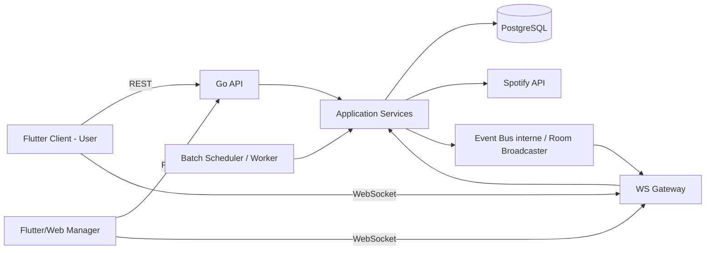
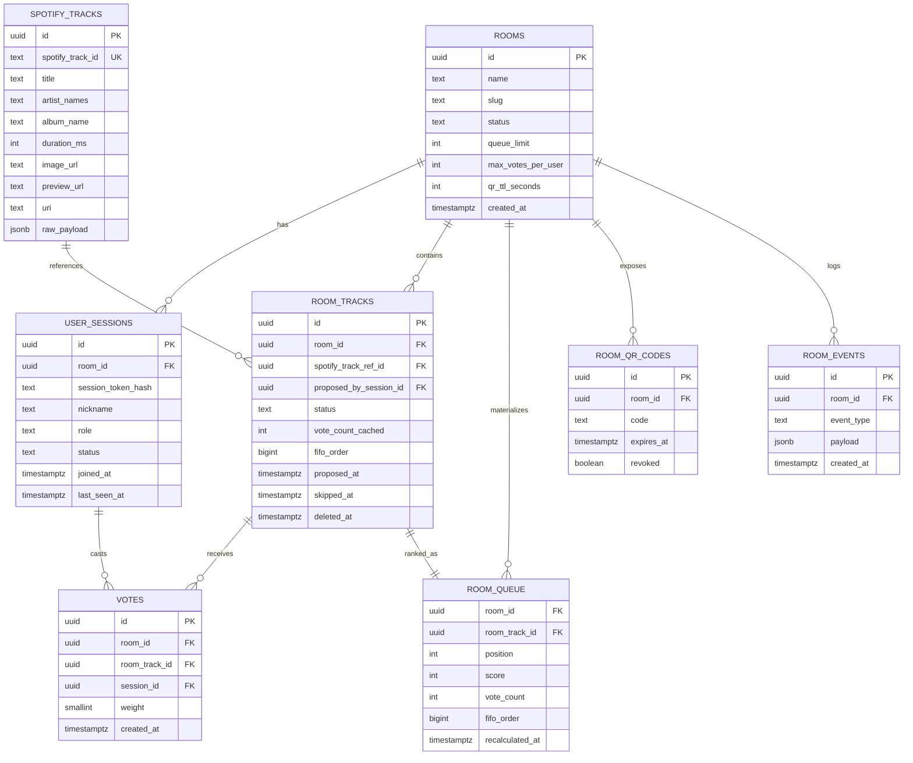
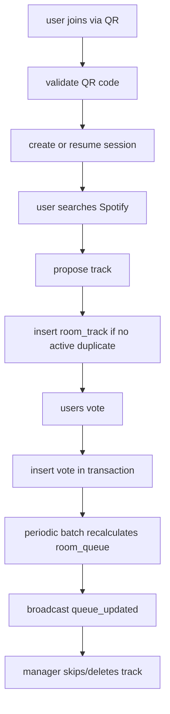
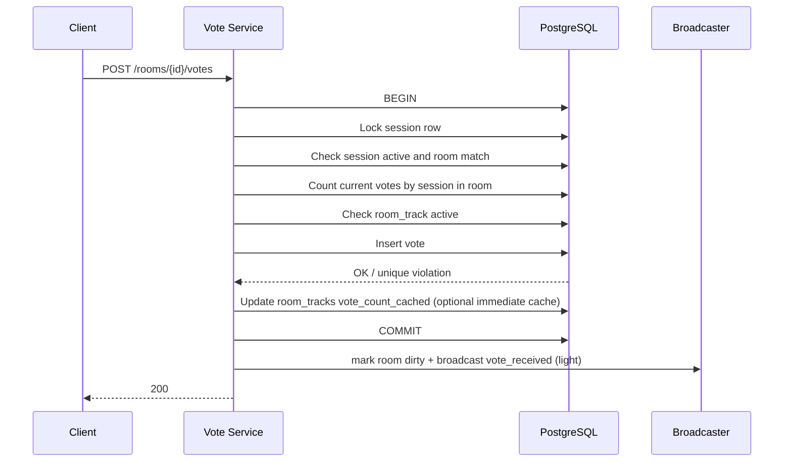
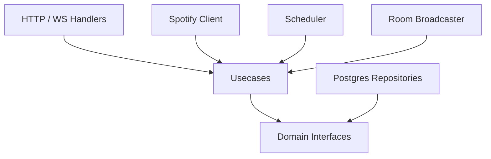
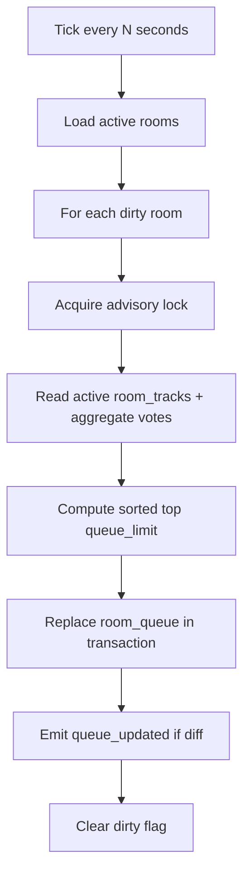

# Architecture backend MVP — Crowd Beats

## 1. Objectif backend

Construire un backend **Go + PostgreSQL + WebSocket** pour un MVP d’application collaborative de vote musical en bar, avec les objectifs suivants :

- simplicité d’implémentation
- robustesse métier
- cohérence forte sur les votes et la queue
- temps réel pour l’affichage
- architecture extensible sans sur-ingénierie

Le backend ne pilote **pas** la lecture audio dans le MVP. Il gère uniquement :

- rooms
- sessions anonymes persistées
- propositions Spotify
- votes
- recalcul batch de la queue
- synchronisation temps réel
- actions manager

---

## 2. Principes d’architecture

### 2.1 Choix structurants

1. **Une room active par session utilisateur**  
   La contrainte est portée à la fois par la logique métier et par le modèle de données.

2. **Session anonyme persistée**  
   Pas de compte. Un `session_token` signé ou aléatoire permet la reconnexion.

3. **Song catalog séparé des songs proposées dans une room**  
   On distingue :
   - la donnée Spotify canonique
   - l’occurrence d’un morceau proposé dans une room

4. **Votes immuables tant que la room est active**  
   Un vote = une ligne. La suppression d’une musique supprime hard ses votes via cascade.

5. **Queue matérialisée en base**  
   La queue n’est pas recalculée à chaque vote. Un job batch recalcule l’ordre et persiste le résultat.

6. **WebSocket pour la diffusion, REST pour les commandes**  
   - REST = opérations métier explicites
   - WebSocket = push des changements aux clients

7. **Idempotence et contraintes SQL d’abord**  
   Les règles critiques sont sécurisées au niveau PostgreSQL avant d’être sécurisées en Go.

---

## 3. Vue d’ensemble du système



---

## 4. Modèle de données

## 4.1 Vue conceptuelle



---

## 4.2 Tables détaillées

### 4.2.1 `rooms`

Représente un établissement ou une room active de soirée.

| Champ | Type | Contraintes | Description |
|---|---|---|---|
| `id` | `uuid` | PK | identifiant room |
| `name` | `text` | not null | nom affiché |
| `slug` | `text` | unique | identifiant lisible optionnel |
| `status` | `text` | check in (`draft`,`active`,`paused`,`closed`) | état room |
| `queue_limit` | `integer` | not null default 20 check `> 0` | taille max queue |
| `max_votes_per_user` | `integer` | not null default 5 check between 1 and 20 | quota utilisateur |
| `qr_ttl_seconds` | `integer` | not null default 14400 | durée validité QR |
| `recalc_interval_seconds` | `integer` | not null default 10 | fréquence batch |
| `manager_secret_hash` | `text` | nullable | auth simple manager MVP |
| `created_at` | `timestamptz` | not null default now() | création |
| `updated_at` | `timestamptz` | not null default now() | maj |

**Index**
- `uq_rooms_slug (slug)`
- `idx_rooms_status (status)`

---

### 4.2.2 `room_qr_codes`

Permet de gérer des QR temporaires et révocables.

| Champ | Type | Contraintes |
|---|---|---|
| `id` | `uuid` | PK |
| `room_id` | `uuid` | FK -> `rooms(id)` on delete cascade |
| `code` | `text` | unique not null |
| `expires_at` | `timestamptz` | not null |
| `revoked` | `boolean` | not null default false |
| `created_at` | `timestamptz` | not null default now() |

**Index**
- `uq_room_qr_codes_code (code)`
- `idx_room_qr_codes_room_id (room_id)`
- `idx_room_qr_codes_expires_at (expires_at)`

---

### 4.2.3 `user_sessions`

Session anonyme persistée côté backend.

| Champ | Type | Contraintes | Description |
|---|---|---|---|
| `id` | `uuid` | PK | session id interne |
| `room_id` | `uuid` | FK -> `rooms(id)` on delete cascade | room courante |
| `session_token_hash` | `text` | unique not null | hash du token client |
| `nickname` | `text` | not null | pseudo courant |
| `role` | `text` | check in (`guest`,`manager`) not null | type utilisateur |
| `status` | `text` | check in (`active`,`left`,`expired`,`banned`) not null default `active` | état session |
| `joined_at` | `timestamptz` | not null default now() | entrée room |
| `last_seen_at` | `timestamptz` | not null default now() | heartbeat |
| `left_at` | `timestamptz` | nullable | sortie |
| `client_fingerprint` | `text` | nullable | anti-abus léger |
| `created_at` | `timestamptz` | not null default now() | création |
| `updated_at` | `timestamptz` | not null default now() | maj |

**Contraintes métier**
- un token = une session persistée
- une session active ne peut pointer que vers une room
- si on rejoint une nouvelle room, on clôt proprement l’ancienne session active avant update

**Index**
- `uq_user_sessions_session_token_hash`
- `idx_user_sessions_room_id_status (room_id, status)`
- `idx_user_sessions_last_seen_at (last_seen_at)`

---

### 4.2.4 `spotify_tracks`

Catalogue local minimal des morceaux Spotify déjà consultés/proposés.

| Champ | Type | Contraintes |
|---|---|---|
| `id` | `uuid` | PK |
| `spotify_track_id` | `text` | unique not null |
| `title` | `text` | not null |
| `artist_names` | `text` | not null |
| `album_name` | `text` | nullable |
| `duration_ms` | `integer` | nullable |
| `image_url` | `text` | nullable |
| `preview_url` | `text` | nullable |
| `uri` | `text` | nullable |
| `raw_payload` | `jsonb` | not null default `'{}'::jsonb` |
| `created_at` | `timestamptz` | not null default now() |
| `updated_at` | `timestamptz` | not null default now() |

**Index**
- `uq_spotify_tracks_spotify_track_id`

---

### 4.2.5 `room_tracks`

Occurrence d’un morceau proposé dans une room.

| Champ | Type | Contraintes | Description |
|---|---|---|---|
| `id` | `uuid` | PK | proposition unique |
| `room_id` | `uuid` | FK -> `rooms(id)` on delete cascade | room |
| `spotify_track_ref_id` | `uuid` | FK -> `spotify_tracks(id)` on delete restrict | track canonique |
| `proposed_by_session_id` | `uuid` | FK -> `user_sessions(id)` on delete set null | auteur proposition |
| `status` | `text` | check in (`queued`,`playing`,`played`,`skipped`,`deleted`) not null default `queued` | état |
| `vote_count_cached` | `integer` | not null default 0 | cache optimisé |
| `score_cached` | `integer` | not null default 0 | score batch courant |
| `fifo_order` | `bigint` | not null | ordre d’arrivée |
| `proposed_at` | `timestamptz` | not null default now() | date proposition |
| `played_at` | `timestamptz` | nullable | date lecture manuelle |
| `skipped_at` | `timestamptz` | nullable | date skip |
| `deleted_at` | `timestamptz` | nullable | date suppression logique éventuelle |
| `created_at` | `timestamptz` | not null default now() | création |
| `updated_at` | `timestamptz` | not null default now() | maj |

**Contrainte anti-doublon active**

On veut empêcher qu’un même track Spotify soit proposé deux fois **en même temps** dans une même room tant qu’il est en file active.

```sql
create unique index uq_room_tracks_active_unique_track
on room_tracks (room_id, spotify_track_ref_id)
where status in ('queued', 'playing');
```

Cela permet :
- d’interdire doublon actif
- de réautoriser le même morceau plus tard s’il est `played`, `skipped` ou `deleted`

**Autres index**
- `idx_room_tracks_room_status (room_id, status)`
- `idx_room_tracks_room_fifo (room_id, fifo_order)`
- `idx_room_tracks_proposed_by (proposed_by_session_id)`

---

### 4.2.6 `votes`

Un vote utilisateur sur une proposition dans une room.

| Champ | Type | Contraintes |
|---|---|---|
| `id` | `uuid` | PK |
| `room_id` | `uuid` | FK -> `rooms(id)` on delete cascade |
| `room_track_id` | `uuid` | FK -> `room_tracks(id)` on delete cascade |
| `session_id` | `uuid` | FK -> `user_sessions(id)` on delete cascade |
| `weight` | `smallint` | not null default 1 check (`weight = 1`) |
| `created_at` | `timestamptz` | not null default now() |

**Contraintes critiques**

1. **1 vote max par user par musique**
```sql
create unique index uq_votes_session_track
on votes (session_id, room_track_id);
```

2. **Cohérence room/session/track**  
À sécuriser dans le service transactionnel Go :
- `session.room_id == room_id`
- `room_track.room_id == room_id`

3. **Quota de votes par session**  
Vérifié transactionnellement dans le service.

**Index**
- `idx_votes_room_track_id (room_track_id)`
- `idx_votes_session_id (session_id)`
- `idx_votes_room_id (room_id)`

---

### 4.2.7 `room_queue`

Snapshot matérialisé de la queue visible par les clients.

| Champ | Type | Contraintes |
|---|---|---|
| `room_id` | `uuid` | FK -> `rooms(id)` on delete cascade |
| `room_track_id` | `uuid` | FK -> `room_tracks(id)` on delete cascade |
| `position` | `integer` | not null |
| `score` | `integer` | not null |
| `vote_count` | `integer` | not null |
| `fifo_order` | `bigint` | not null |
| `recalculated_at` | `timestamptz` | not null |

**Clés**
```sql
alter table room_queue add primary key (room_id, room_track_id);
create unique index uq_room_queue_room_position on room_queue (room_id, position);
```

**Rôle**
- évite de recalculer la queue à chaque lecture client
- donne un ordre stable
- permet un broadcast unique `queue_updated`

---

### 4.2.8 `room_events`

Journal léger pour audit/debug/replay simple.

| Champ | Type | Contraintes |
|---|---|---|
| `id` | `uuid` | PK |
| `room_id` | `uuid` | FK -> `rooms(id)` on delete cascade |
| `event_type` | `text` | not null |
| `payload` | `jsonb` | not null default `'{}'::jsonb` |
| `created_at` | `timestamptz` | not null default now() |

**Exemples**
- `user_joined`
- `track_proposed`
- `vote_added`
- `track_deleted`
- `track_skipped`
- `queue_recalculated`

---

## 4.3 Relations essentielles

- `rooms 1 -> n user_sessions`
- `rooms 1 -> n room_tracks`
- `spotify_tracks 1 -> n room_tracks`
- `room_tracks 1 -> n votes`
- `user_sessions 1 -> n votes`
- `rooms 1 -> n room_qr_codes`
- `rooms 1 -> n room_events`
- `rooms 1 -> n room_queue`

---

## 4.4 DDL recommandé



### Exemple SQL synthétique

```sql
create table rooms (
  id uuid primary key,
  name text not null,
  slug text unique,
  status text not null check (status in ('draft', 'active', 'paused', 'closed')),
  queue_limit integer not null default 20 check (queue_limit > 0),
  max_votes_per_user integer not null default 5 check (max_votes_per_user between 1 and 20),
  qr_ttl_seconds integer not null default 14400,
  recalc_interval_seconds integer not null default 10,
  manager_secret_hash text,
  created_at timestamptz not null default now(),
  updated_at timestamptz not null default now()
);

create table room_qr_codes (
  id uuid primary key,
  room_id uuid not null references rooms(id) on delete cascade,
  code text not null unique,
  expires_at timestamptz not null,
  revoked boolean not null default false,
  created_at timestamptz not null default now()
);

create table user_sessions (
  id uuid primary key,
  room_id uuid not null references rooms(id) on delete cascade,
  session_token_hash text not null unique,
  nickname text not null,
  role text not null check (role in ('guest', 'manager')),
  status text not null default 'active' check (status in ('active', 'left', 'expired', 'banned')),
  joined_at timestamptz not null default now(),
  last_seen_at timestamptz not null default now(),
  left_at timestamptz,
  client_fingerprint text,
  created_at timestamptz not null default now(),
  updated_at timestamptz not null default now()
);

create table spotify_tracks (
  id uuid primary key,
  spotify_track_id text not null unique,
  title text not null,
  artist_names text not null,
  album_name text,
  duration_ms integer,
  image_url text,
  preview_url text,
  uri text,
  raw_payload jsonb not null default '{}'::jsonb,
  created_at timestamptz not null default now(),
  updated_at timestamptz not null default now()
);

create table room_tracks (
  id uuid primary key,
  room_id uuid not null references rooms(id) on delete cascade,
  spotify_track_ref_id uuid not null references spotify_tracks(id) on delete restrict,
  proposed_by_session_id uuid references user_sessions(id) on delete set null,
  status text not null default 'queued' check (status in ('queued', 'playing', 'played', 'skipped', 'deleted')),
  vote_count_cached integer not null default 0,
  score_cached integer not null default 0,
  fifo_order bigint not null,
  proposed_at timestamptz not null default now(),
  played_at timestamptz,
  skipped_at timestamptz,
  deleted_at timestamptz,
  created_at timestamptz not null default now(),
  updated_at timestamptz not null default now()
);

create unique index uq_room_tracks_active_unique_track
on room_tracks (room_id, spotify_track_ref_id)
where status in ('queued', 'playing');

create table votes (
  id uuid primary key,
  room_id uuid not null references rooms(id) on delete cascade,
  room_track_id uuid not null references room_tracks(id) on delete cascade,
  session_id uuid not null references user_sessions(id) on delete cascade,
  weight smallint not null default 1 check (weight = 1),
  created_at timestamptz not null default now()
);

create unique index uq_votes_session_track
on votes (session_id, room_track_id);

create table room_queue (
  room_id uuid not null references rooms(id) on delete cascade,
  room_track_id uuid not null references room_tracks(id) on delete cascade,
  position integer not null,
  score integer not null,
  vote_count integer not null,
  fifo_order bigint not null,
  recalculated_at timestamptz not null,
  primary key (room_id, room_track_id)
);

create unique index uq_room_queue_room_position
on room_queue (room_id, position);

create table room_events (
  id uuid primary key,
  room_id uuid not null references rooms(id) on delete cascade,
  event_type text not null,
  payload jsonb not null default '{}'::jsonb,
  created_at timestamptz not null default now()
);
```

---

## 5. Design des entités principales

## 5.1 User session

```go
type UserSession struct {
    ID                uuid.UUID
    RoomID            uuid.UUID
    SessionTokenHash  string
    Nickname          string
    Role              string // guest | manager
    Status            string // active | left | expired | banned
    JoinedAt          time.Time
    LastSeenAt        time.Time
    LeftAt            *time.Time
    ClientFingerprint *string
    CreatedAt         time.Time
    UpdatedAt         time.Time
}
```

### Rôle métier
- identité anonyme persistée
- rattachement à une room
- porteur des quotas de vote
- support de reconnexion et de présence

---

## 5.2 Room

```go
type Room struct {
    ID                   uuid.UUID
    Name                 string
    Slug                 *string
    Status               string
    QueueLimit           int
    MaxVotesPerUser      int
    QRTTLSeconds         int
    RecalcIntervalSeconds int
    ManagerSecretHash    *string
    CreatedAt            time.Time
    UpdatedAt            time.Time
}
```

### Rôle métier
- encapsule les règles configurables
- unité de diffusion WebSocket
- périmètre de cohérence forte

---

## 5.3 SpotifyTrack

```go
type SpotifyTrack struct {
    ID             uuid.UUID
    SpotifyTrackID string
    Title          string
    ArtistNames    string
    AlbumName      *string
    DurationMs     *int
    ImageURL       *string
    PreviewURL     *string
    URI            *string
    RawPayload     json.RawMessage
    CreatedAt      time.Time
    UpdatedAt      time.Time
}
```

---

## 5.4 RoomTrack

```go
type RoomTrack struct {
    ID                  uuid.UUID
    RoomID              uuid.UUID
    SpotifyTrackRefID   uuid.UUID
    ProposedBySessionID *uuid.UUID
    Status              string
    VoteCountCached     int
    ScoreCached         int
    FIFOOrder           int64
    ProposedAt          time.Time
    PlayedAt            *time.Time
    SkippedAt           *time.Time
    DeletedAt           *time.Time
    CreatedAt           time.Time
    UpdatedAt           time.Time
}
```

### Important
`RoomTrack` n’est pas le catalogue Spotify. C’est **la proposition contextualisée à une room**.

---

## 5.5 Vote

```go
type Vote struct {
    ID         uuid.UUID
    RoomID     uuid.UUID
    RoomTrackID uuid.UUID
    SessionID  uuid.UUID
    Weight     int16
    CreatedAt  time.Time
}
```

---

## 5.6 QueueItem

```go
type QueueItem struct {
    RoomID         uuid.UUID
    RoomTrackID    uuid.UUID
    Position       int
    Score          int
    VoteCount      int
    FIFOOrder      int64
    RecalculatedAt time.Time
}
```

---

## 6. API REST complète

## 6.1 Conventions

- Base path : `/api/v1`
- Auth session user : header `Authorization: Bearer <session_token>`
- Auth manager MVP :
  - soit bearer manager dédié
  - soit session manager créée côté back-office
- Réponses JSON
- Toute écriture critique est transactionnelle

### Format réponse standard

```json
{
  "data": {},
  "error": null,
  "meta": {}
}
```

### Format erreur

```json
{
  "data": null,
  "error": {
    "code": "VOTE_LIMIT_REACHED",
    "message": "Vote limit reached for this session"
  },
  "meta": {}
}
```

---

## 6.2 Endpoints rooms / join

### `POST /rooms/join-by-qr`
Valide un QR code et crée ou restaure une session.

#### Request
```json
{
  "qr_code": "qr_abcd1234",
  "nickname": "Alex",
  "session_token": "optional_existing_token"
}
```

#### Response
```json
{
  "data": {
    "room": {
      "id": "room_uuid",
      "name": "Le Neon",
      "status": "active",
      "queue_limit": 20,
      "max_votes_per_user": 5
    },
    "session": {
      "id": "session_uuid",
      "nickname": "Alex",
      "role": "guest",
      "token": "plain_session_token"
    },
    "ws": {
      "url": "wss://api.example.com/ws?room_id=..."
    }
  },
  "error": null,
  "meta": {}
}
```

#### Règles
- si `session_token` existe et est valide, on réattache la session
- si la session est dans une autre room active, on la ferme avant de la rattacher
- QR expiré ou révoqué => 403

---

### `GET /rooms/{roomId}`
Retourne les infos publiques de la room.

### `GET /rooms/{roomId}/queue`
Retourne la queue matérialisée.

#### Response
```json
{
  "data": {
    "items": [
      {
        "position": 1,
        "room_track_id": "uuid",
        "score": 6,
        "vote_count": 6,
        "fifo_order": 1711983012,
        "track": {
          "spotify_track_id": "2TpxZ7JUBn3uw46aR7qd6V",
          "title": "Hey Ya!",
          "artist_names": "Outkast",
          "image_url": "https://..."
        },
        "proposed_by": {
          "nickname": "Alex"
        }
      }
    ],
    "updated_at": "2026-04-01T18:00:00Z"
  },
  "error": null,
  "meta": {}
}
```

### `GET /rooms/{roomId}/stats`
Stats manager.

#### Response
```json
{
  "data": {
    "active_users": 47,
    "tracks_in_queue": 20,
    "votes_count": 132,
    "top_tracks": [
      {
        "title": "Hey Ya!",
        "artist_names": "Outkast",
        "votes": 8
      }
    ]
  },
  "error": null,
  "meta": {}
}
```

---

## 6.3 Endpoints Spotify / search

### `GET /spotify/search?q={query}`
Proxy backend vers Spotify Search API.

#### Response
```json
{
  "data": {
    "items": [
      {
        "spotify_track_id": "2TpxZ7JUBn3uw46aR7qd6V",
        "title": "Hey Ya!",
        "artist_names": "Outkast",
        "album_name": "Speakerboxxx/The Love Below",
        "duration_ms": 235213,
        "image_url": "https://...",
        "uri": "spotify:track:2TpxZ7JUBn3uw46aR7qd6V"
      }
    ]
  },
  "error": null,
  "meta": {}
}
```

### Recommandation implémentation
- cache mémoire court 15 à 60 secondes pour éviter surcharge Spotify
- rate limit local par IP/session

---

## 6.4 Endpoints propositions

### `POST /rooms/{roomId}/tracks`
Propose une musique.

#### Request
```json
{
  "spotify_track_id": "2TpxZ7JUBn3uw46aR7qd6V"
}
```

#### Response succès
```json
{
  "data": {
    "room_track": {
      "id": "room_track_uuid",
      "status": "queued",
      "position": 8
    },
    "duplicate": false
  },
  "error": null,
  "meta": {}
}
```

#### Response doublon actif
```json
{
  "data": {
    "duplicate": true,
    "existing_room_track": {
      "id": "room_track_uuid",
      "current_vote_count": 4,
      "position": 2
    }
  },
  "error": null,
  "meta": {}
}
```

#### Règles
- refuse si room non active
- refuse si queue active pleine selon stratégie choisie
- recommande stratégie MVP : **accepter la proposition seulement si nombre de `room_tracks` actifs < queue_limit**
- sinon `QUEUE_FULL`

---

### `DELETE /rooms/{roomId}/tracks/{roomTrackId}`
Suppression hard par manager.

#### Effet
- delete `room_tracks`
- cascade delete `votes`
- trigger recalcul immédiat ou drapeau dirty pour prochain batch
- broadcast `track_deleted`

#### Response
```json
{
  "data": {
    "deleted": true,
    "room_track_id": "uuid"
  },
  "error": null,
  "meta": {}
}
```

---

### `POST /rooms/{roomId}/tracks/{roomTrackId}/skip`
Le manager marque la track comme skip.

#### Effet
- update `status = skipped`, `skipped_at = now()`
- suppression de sa présence future dans `room_queue`
- broadcast `track_skipped`

---

### `POST /rooms/{roomId}/tracks/{roomTrackId}/mark-playing`
Option utile côté manager pour refléter le morceau en cours.

#### Effet
- mettre la track en `playing`
- retirer toute autre `playing`
- broadcast `track_playing`

---

### `POST /rooms/{roomId}/tracks/{roomTrackId}/mark-played`
Quand le morceau est terminé manuellement.

#### Effet
- `status = played`
- sort de la queue
- recalcul queue

---

## 6.5 Endpoints votes

### `POST /rooms/{roomId}/votes`
Ajoute un vote sur une proposition.

#### Request
```json
{
  "room_track_id": "room_track_uuid"
}
```

#### Response
```json
{
  "data": {
    "vote_added": true,
    "room_track_id": "room_track_uuid",
    "current_vote_count": 5,
    "votes_remaining": 1
  },
  "error": null,
  "meta": {}
}
```

#### Erreurs métier
- `ALREADY_VOTED_FOR_TRACK`
- `VOTE_LIMIT_REACHED`
- `ROOM_TRACK_NOT_ACTIVE`
- `SESSION_NOT_IN_ROOM`

### `DELETE /rooms/{roomId}/votes/{roomTrackId}`
Optionnel selon UX. Pour MVP strict, on peut **ne pas exposer unvote** pour réduire la complexité.

Recommandation MVP : **pas de retrait de vote**.

---

## 6.6 Endpoints session / présence

### `GET /sessions/me`
Retourne la session courante.

### `POST /sessions/heartbeat`
Met à jour `last_seen_at`.

#### Request
```json
{
  "room_id": "room_uuid"
}
```

### `POST /sessions/leave`
Marque la session comme `left`.

---

## 6.7 Endpoints manager

### `POST /manager/rooms`
Création room.

### `POST /manager/rooms/{roomId}/qr-codes`
Génère un QR temporaire.

#### Request
```json
{
  "expires_in_seconds": 14400
}
```

### `PATCH /manager/rooms/{roomId}`
Met à jour configuration.

#### Request
```json
{
  "queue_limit": 25,
  "max_votes_per_user": 4,
  "status": "active"
}
```

### `GET /manager/rooms/{roomId}/stats`
Stats détaillées.

---

## 7. Logique métier détaillée

## 7.1 Score et tri de queue

### Règle MVP recommandée
Le score est simplement :

```text
score = vote_count
```

Puis tri :
1. `score DESC`
2. `fifo_order ASC`

Cela respecte :
- simplicité
- lisibilité
- comportement prédictible
- FIFO à égalité

### Pourquoi ne pas faire plus complexe au MVP
Éviter pour le MVP :
- time decay
- pondération par ancienneté
- boost auteur
- anti-fraude sophistiquée dans le score

---

## 7.2 Recalcul batch de la queue

### Principe
Toutes les `N` secondes par room active :
- lire les tracks `queued` ou `playing` selon règle d’affichage
- agréger les votes
- recalculer ordre
- limiter à `queue_limit`
- remplacer atomiquement `room_queue`
- broadcast si changement

### Requête type

```sql
select
  rt.id as room_track_id,
  count(v.id)::int as vote_count,
  rt.fifo_order
from room_tracks rt
left join votes v on v.room_track_id = rt.id
where rt.room_id = $1
  and rt.status = 'queued'
group by rt.id, rt.fifo_order
order by count(v.id) desc, rt.fifo_order asc
limit $2;
```

### Remplacement atomique recommandé
Dans une transaction :
1. lock léger room-scoped
2. delete `room_queue where room_id = $1`
3. bulk insert nouveau snapshot
4. update `room_tracks.vote_count_cached` + `score_cached`
5. commit

### Déclenchement
- scheduler toutes les `N` secondes
- recalcul immédiat optionnel après action manager critique
- optimisation : recalcul uniquement si room marquée `dirty`

---

## 7.3 Mécanisme `dirty room`

Ajouter en mémoire ou en base un état de salissure logique.

### Option simple MVP
En mémoire dans le process backend :
- `roomDirty[roomID] = true` lors de :
  - nouveau vote
  - nouvelle proposition
  - delete
  - skip
- worker batch ne recalcule que les rooms dirty
- après recalcul : `roomDirty[roomID] = false`

### Si multi-instance plus tard
Passer ce dirty flag en base ou Redis.

---

## 7.4 Gestion transactionnelle du vote

### Algorithme



### Pseudocode

```go
func (s *VoteService) AddVote(ctx context.Context, roomID, sessionID, roomTrackID uuid.UUID) error {
    return s.txManager.WithTx(ctx, func(tx Tx) error {
        session := tx.SessionRepo().GetForUpdate(sessionID)
        if session.RoomID != roomID || session.Status != "active" {
            return ErrSessionNotInRoom
        }

        track := tx.RoomTrackRepo().GetForUpdate(roomTrackID)
        if track.RoomID != roomID || track.Status != "queued" {
            return ErrTrackNotVotable
        }

        usedVotes := tx.VoteRepo().CountBySessionInRoom(sessionID, roomID)
        room := tx.RoomRepo().Get(roomID)
        if usedVotes >= room.MaxVotesPerUser {
            return ErrVoteLimitReached
        }

        err := tx.VoteRepo().Insert(Vote{...})
        if IsUniqueViolation(err, "uq_votes_session_track") {
            return ErrAlreadyVotedForTrack
        }
        if err != nil {
            return err
        }

        _ = tx.RoomTrackRepo().IncrementVoteCache(roomTrackID)
        return nil
    })
}
```

### Note importante
Le quota de vote est **par session dans la room**, pas par période ni par morceau.

---

## 7.5 Gestion transactionnelle de la proposition

### Algorithme
1. vérifier room active
2. récupérer ou upsert `spotify_tracks`
3. tenter `insert room_tracks`
4. si violation de l’index partiel anti-doublon : retourner le morceau existant
5. marquer room dirty
6. broadcast `track_proposed`

### Pseudocode simplifié

```go
func (s *TrackService) ProposeTrack(ctx context.Context, roomID, sessionID uuid.UUID, spotifyTrackID string) (*ProposalResult, error) {
    return s.txManager.WithTxResult(ctx, func(tx Tx) (*ProposalResult, error) {
        room := tx.RoomRepo().Get(roomID)
        if room.Status != "active" {
            return nil, ErrRoomInactive
        }

        activeCount := tx.RoomTrackRepo().CountActive(roomID)
        if activeCount >= room.QueueLimit {
            return nil, ErrQueueFull
        }

        catalogTrack := tx.SpotifyTrackRepo().UpsertFromSpotify(spotifyTrackID)

        result, err := tx.RoomTrackRepo().InsertQueued(roomID, catalogTrack.ID, sessionID)
        if IsUniqueViolation(err, "uq_room_tracks_active_unique_track") {
            existing := tx.RoomTrackRepo().GetActiveBySpotifyTrack(roomID, catalogTrack.ID)
            return &ProposalResult{Duplicate: true, Existing: existing}, nil
        }
        if err != nil {
            return nil, err
        }

        return &ProposalResult{Duplicate: false, Track: result}, nil
    })
}
```

---

## 7.6 Suppression hard

### Exigence produit
Suppression complète avec votes associés.

### Stratégie
- soit `DELETE FROM room_tracks WHERE id = $1`
- les votes tombent via `ON DELETE CASCADE`

### Pourquoi hard delete ici
- conforme au besoin produit
- simplifie les stats temps réel
- évite de devoir filtrer des tombstones partout

### Réserve
Pour audit plus tard, on garde un `room_events` séparé, pas la ligne métier supprimée.

---

## 7.7 Anti-spam MVP

### Minimum viable robuste
1. **rate limit** sur endpoints sensibles
   - join room
   - spotify search
   - propose track
   - vote

2. **nickname validation**
   - longueur min/max
   - blacklist simple

3. **client fingerprint optionnel**
   - non bloquant
   - utile pour modération plus tard

4. **1 vote max par track par session** via contrainte SQL

5. **vote quota total** par session via transaction

6. **1 room active par session** via service métier

7. **QR expirables**

### Rate limits recommandés
- join: 10/min/IP
- search: 30/min/session
- propose: 10/min/session
- vote: 20/min/session

---

## 8. Architecture backend Go

## 8.1 Style recommandé

**Modular monolith** orienté domaine.

Pourquoi :
- MVP plus rapide qu’une micro-architecture distribuée
- tests plus simples
- transactions SQL faciles
- évolutif ensuite par extraction si nécessaire

---

## 8.2 Structure de projet recommandée

```text
crowd-beats-backend/
├── cmd/
│   ├── api/
│   │   └── main.go
│   └── worker/
│       └── main.go
├── internal/
│   ├── app/
│   │   ├── bootstrap.go
│   │   ├── config.go
│   │   └── router.go
│   ├── domain/
│   │   ├── room/
│   │   │   ├── entity.go
│   │   │   ├── repository.go
│   │   │   ├── service.go
│   │   │   └── errors.go
│   │   ├── session/
│   │   ├── track/
│   │   ├── vote/
│   │   ├── queue/
│   │   └── spotify/
│   ├── usecase/
│   │   ├── join_room.go
│   │   ├── propose_track.go
│   │   ├── add_vote.go
│   │   ├── recalculate_queue.go
│   │   ├── delete_track.go
│   │   └── skip_track.go
│   ├── infra/
│   │   ├── db/
│   │   │   ├── postgres.go
│   │   │   ├── migrations/
│   │   │   └── repositories/
│   │   ├── http/
│   │   │   ├── middleware/
│   │   │   ├── handlers/
│   │   │   └── dto/
│   │   ├── ws/
│   │   │   ├── hub.go
│   │   │   ├── client.go
│   │   │   ├── handler.go
│   │   │   └── events.go
│   │   ├── spotify/
│   │   │   └── client.go
│   │   ├── scheduler/
│   │   │   └── queue_recalc.go
│   │   └── cache/
│   │       └── memory.go
│   ├── platform/
│   │   ├── logger/
│   │   ├── auth/
│   │   ├── clock/
│   │   └── ratelimit/
│   └── shared/
│       ├── ptr/
│       └── errs/
├── pkg/
│   └── apierror/
├── migrations/
├── deployments/
├── Makefile
└── README.md
```

---

## 8.3 Séparation des responsabilités

### Domain
- entités métier
- interfaces repository
- règles invariantes
- erreurs métier

### Usecases
- orchestration des transactions
- coordination cross-domain
- pas de détails HTTP/WebSocket

### Infra
- implémentation PostgreSQL
- handlers REST
- client Spotify
- hub WebSocket
- scheduler

### Platform
- logging
- configuration
- auth token
- rate limiting

---

## 8.4 Dépendances directionnelles



Règle : le domaine ne dépend jamais de l’infra.

---

## 9. Gestion WebSocket

## 9.1 Rôle du WebSocket

Le WebSocket ne remplace pas les commandes REST. Il sert à :
- notifier instantanément les changements
- synchroniser l’état visible
- pousser la queue recalculée

### Bonne pratique MVP
- **écritures via REST**
- **lectures live via WebSocket**

---

## 9.2 Organisation

### Hub par room
En mémoire côté serveur :

```go
type RoomHub struct {
    roomID      uuid.UUID
    clients     map[string]*Client
    register    chan *Client
    unregister  chan *Client
    broadcast   chan Event
}
```

### Registry global

```go
type HubRegistry struct {
    hubs map[uuid.UUID]*RoomHub
    mu   sync.RWMutex
}
```

Chaque room a son groupe de clients abonnés.

---

## 9.3 Auth WebSocket

Connexion :

```text
GET /ws?room_id=<uuid>
Authorization: Bearer <session_token>
```

À l’ouverture :
- valider token
- charger session
- vérifier session active dans la room
- enregistrer client dans le hub room

---

## 9.4 Événements WebSocket

### Envelope standard

```json
{
  "event": "queue_updated",
  "room_id": "room_uuid",
  "timestamp": "2026-04-01T18:00:00Z",
  "payload": {}
}
```

### Événements recommandés

#### `room_joined`
Quand un client rejoint avec succès.

```json
{
  "event": "room_joined",
  "payload": {
    "session_id": "uuid",
    "nickname": "Alex"
  }
}
```

#### `presence_updated`
Pour compteur utilisateurs actifs.

```json
{
  "event": "presence_updated",
  "payload": {
    "active_users": 42
  }
}
```

#### `track_proposed`

```json
{
  "event": "track_proposed",
  "payload": {
    "room_track_id": "uuid",
    "spotify_track_id": "...",
    "title": "Hey Ya!",
    "artist_names": "Outkast"
  }
}
```

#### `vote_received`
Événement léger, sans forcer réordonnancement immédiat visuel.

```json
{
  "event": "vote_received",
  "payload": {
    "room_track_id": "uuid",
    "current_vote_count": 5
  }
}
```

#### `queue_updated`
Événement principal après batch.

```json
{
  "event": "queue_updated",
  "payload": {
    "updated_at": "2026-04-01T18:00:00Z",
    "items": [
      {
        "position": 1,
        "room_track_id": "uuid",
        "score": 5,
        "vote_count": 5
      }
    ]
  }
}
```

#### `track_deleted`

```json
{
  "event": "track_deleted",
  "payload": {
    "room_track_id": "uuid"
  }
}
```

#### `track_skipped`

```json
{
  "event": "track_skipped",
  "payload": {
    "room_track_id": "uuid"
  }
}
```

#### `track_playing`

```json
{
  "event": "track_playing",
  "payload": {
    "room_track_id": "uuid"
  }
}
```

#### `error`

```json
{
  "event": "error",
  "payload": {
    "code": "ROOM_CLOSED",
    "message": "Room is closed"
  }
}
```

---

## 9.5 Stratégie de synchro multi-clients

### Important
Le WebSocket push **des événements métier**, mais la source de vérité reste PostgreSQL.

### Règle de robustesse
- toute écriture persiste d’abord en DB
- ensuite seulement broadcast
- si broadcast échoue, les clients peuvent se resynchroniser via REST `GET /rooms/{roomId}/queue`

### Reconnexion client
Au reconnect :
1. auth session
2. rejoin hub room
3. client recharge queue et état room via REST
4. reprend les événements live

C’est plus robuste qu’un replay WebSocket complexe pour un MVP.

---

## 10. Scheduler et worker de recalcul

## 10.1 Mode MVP simple
Un worker intégré au backend ou process séparé.

### Recommandation
- **1 process API**
- **1 process worker** pour batch queue si besoin de clarté

Au tout début, un seul binaire peut suffire.

---

## 10.2 Algorithme worker



### Advisory lock PostgreSQL recommandé
Pour éviter deux recalculs concurrents sur la même room :

```sql
select pg_try_advisory_xact_lock(hashtext($1));
```

ou hash du `room_id`.

---

## 10.3 Détection de diff avant broadcast
Comparer ancien snapshot et nouveau snapshot :
- positions
- set de track ids
- score
- vote_count

Si aucun changement réel, ne pas spammer les clients.

---

## 11. Cohérence des données et gestion des conflits

## 11.1 Invariants à garantir

1. une session active appartient à une seule room
2. une track Spotify active ne peut exister qu’une fois par room
3. un user ne peut voter qu’une seule fois pour une track
4. un user ne peut pas dépasser son quota de votes
5. la queue affichée est cohérente avec le dernier batch validé
6. suppression manager retire aussi tous les votes associés

---

## 11.2 Où garantir chaque invariant

| Invariant | Base | Service Go | Les deux |
|---|---|---|---|
| 1 session = 1 room |  | oui |  |
| 1 track active par room | oui | oui | oui |
| 1 vote par track/user | oui | oui | oui |
| quota max votes |  | oui |  |
| hard delete votes associés | oui |  |  |
| queue limitée |  | oui |  |

---

## 11.3 Gestion des courses critiques

### Cas 1 : deux users proposent la même track en même temps
Solution :
- index unique partiel sur `(room_id, spotify_track_ref_id)` pour statuts actifs
- un insert gagne
- l’autre reçoit duplicate

### Cas 2 : deux votes concurrents du même user sur la même track
Solution :
- unique index `(session_id, room_track_id)`

### Cas 3 : un vote arrive pendant suppression manager
Solution :
- transaction delete vs insert vote
- soit le vote échoue car track absente / supprimée
- soit delete cascade supprime ensuite le vote
- résultat final cohérent

### Cas 4 : deux recalculs batch concurrents
Solution :
- advisory lock par room

### Cas 5 : session reconnecte pendant expiration
Solution :
- status session vérifié à chaque auth
- heartbeat et politique d’expiration claire

---

## 12. Scalabilité

## 12.1 Ce qui scale déjà bien en MVP

- PostgreSQL pour transactions et contraintes
- WebSocket room-scoped
- modular monolith Go efficace
- queue recalculée en batch plutôt qu’à chaque vote

---

## 12.2 Limites futures

### Limite 1 : hubs WebSocket en mémoire
Si plusieurs instances API :
- il faut diffuser les événements entre nœuds
- solution future : Redis Pub/Sub, NATS, Kafka léger selon ambition

### Limite 2 : dirty flags en mémoire
Avec multi-instance, ils doivent être partagés.
- Redis
- table `room_recalc_state`
- ou job queue

### Limite 3 : Spotify rate limiting
Prévoir :
- cache court
- token management propre
- retries backoff

---

## 12.3 Trajectoire d’évolution recommandée

### Phase MVP
- 1 instance API
- 1 PostgreSQL
- WS hub mémoire
- dirty flags mémoire

### Phase pilote multi-bars
- 2+ instances API
- Redis Pub/Sub pour WS fanout
- Redis pour rate limit + dirty flags

### Phase scale
- worker séparé
- event bus
- observabilité complète
- éventuelle séparation read/write ou CQRS léger

---

## 13. Sécurité et auth MVP

## 13.1 Session token

### Recommandation
Token opaque aléatoire 32 bytes, stocké côté client, hashé côté DB.

Pourquoi mieux qu’un JWT ici :
- révocation simple
- rotation simple
- moins de logique embarquée
- session anonyme parfaite pour MVP

---

## 13.2 Manager auth

Pour MVP :
- secret room manager ou login basique séparé
- session manager dédiée
- endpoints manager protégés par middleware de rôle

---

## 13.3 Middlewares REST

- request id
- logger
- recovery
- CORS
- auth session
- auth manager
- rate limit

---

## 14. Observabilité et exploitation

## 14.1 Logs structurés

Logguer au minimum :
- room_id
- session_id
- room_track_id
- endpoint
- latency
- error_code

---

## 14.2 Metrics utiles

- nombre de connexions WebSocket actives
- rooms actives
- recalculs batch/s
- durée moyenne de recalcul
- erreurs Spotify
- taux de votes refusés
- taille moyenne des queues

---

## 14.3 Healthchecks

- `/health/live`
- `/health/ready`
- readiness = DB ok + config ok + Spotify client initialisable

---

## 15. Choix d’implémentation clés

## 15.1 Faut-il stocker la queue séparément ?
Oui.  
Pour ce MVP, **`room_queue` matérialisée** est le meilleur compromis.

Bénéfices :
- lecture simple
- synchro client simple
- ordre stable
- facile à broadcaster

---

## 15.2 Faut-il mettre Redis dès le MVP ?
Non.  
Pas nécessaire si :
- une seule instance backend
- volume pilote raisonnable

---

## 15.3 Faut-il utiliser des triggers SQL pour toute la logique ?
Non.  
Conserver la logique métier en Go, et réserver la base aux :
- contraintes
- cascades
- index
- transactions

---

## 15.4 Faut-il recalculer à chaque vote ?
Non.  
Le batch toutes les 5 à 10 secondes respecte parfaitement le besoin produit et réduit :
- contention DB
- bruit WS
- complexité de tri live

---

## 16. Recommandation finale de design

## Backend recommandé

- **Architecture** : modular monolith Go
- **DB** : PostgreSQL avec contraintes fortes
- **Temps réel** : WebSocket avec hubs par room
- **Queue** : snapshot matérialisé `room_queue`
- **Recalcul** : worker batch périodique + dirty rooms
- **Spotify** : proxy backend + cache court
- **Auth** : token opaque de session

---

## 17. Plan d’implémentation concret

## Sprint 1 — Fondation
- migrations PostgreSQL
- tables principales
- config/app bootstrap
- middleware auth session
- création room manager
- génération QR

## Sprint 2 — Join + sessions
- `join-by-qr`
- session persistée
- heartbeat
- leave
- présence active

## Sprint 3 — Spotify + proposition
- recherche Spotify
- cache court
- `POST /rooms/{id}/tracks`
- anti-doublon actif

## Sprint 4 — Votes
- `POST /votes`
- quotas session
- contrainte unique vote/user/track
- vote cache

## Sprint 5 — Queue batch
- worker recalcul
- `room_queue`
- diff snapshots
- `GET /queue`

## Sprint 6 — WebSocket
- auth WS
- hubs room
- événements live
- resync reconnect

## Sprint 7 — Manager actions + stats
- delete hard
- skip
- mark playing/played
- stats room

## Sprint 8 — Hardening
- rate limiting
- advisory locks
- logs/metrics
- tests de concurrence

---

## 18. Tests critiques à prévoir

### Tests unitaires
- calcul ordre queue
- quota votes
- détection doublon
- room inactive

### Tests intégration DB
- contrainte unique vote
- contrainte anti-doublon track active
- cascade delete votes
- batch recalculation transactionnelle

### Tests concurrence
- double vote simultané
- double proposition simultanée
- vote pendant delete
- double batch recalculation

### Tests end-to-end
- join -> propose -> vote -> batch -> ws update
- reconnect session -> resync queue
- manager delete -> queue refresh

---

## 19. Résumé exécutable

Le design backend le plus propre pour ce MVP est :

1. **PostgreSQL comme source de vérité** avec contraintes fortes.
2. **`spotify_tracks` + `room_tracks`** pour bien séparer catalogue et propositions de room.
3. **`votes` transactionnels** avec quota contrôlé en service.
4. **`room_queue` matérialisée** recalculée en batch toutes les quelques secondes.
5. **WebSocket room-scoped** pour diffuser événements et snapshots de queue.
6. **Modular monolith Go** pour coder vite, tester proprement, et évoluer sans refonte brutale.

C’est un design réaliste, implémentable rapidement, cohérent avec les contraintes produit, et suffisamment solide pour des tests en bars pilotes.
