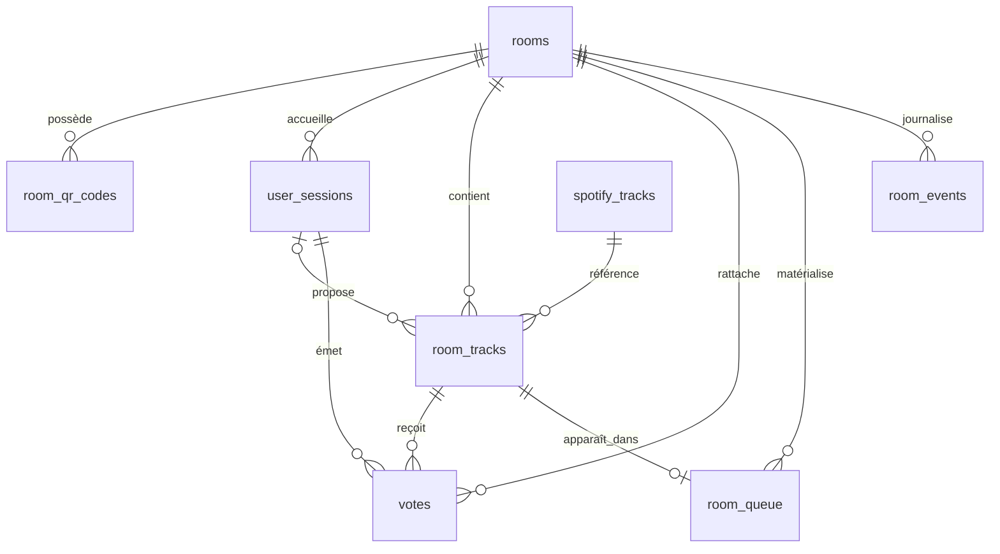

# PostgreSQL et modèle de données

La source de vérité exécutable est [migrations/001_init.sql](../migrations/001_init.sql). [schema.sql](schema.sql) en est une copie documentaire : seule sa première ligne de commentaire diffère. Le backend exécute ce script au démarrage si `AUTO_MIGRATE=true` ; il n'utilise ni table de versions ni framework de migrations. La configuration Docker et les tests utilisent PostgreSQL 16.

## Relations

| Table            | Rôle                                                                                                              |
| ---------------- | ----------------------------------------------------------------------------------------------------------------- |
| `rooms`          | Nom, statut (`draft`, `active`, `paused`, `closed`), paramètres de queue/votes/QR/batch et hash du secret gérant. |
| `room_qr_codes`  | Codes uniques avec date d'expiration et drapeau de révocation.                                                    |
| `user_sessions`  | Présence anonyme rattachée historiquement à une room, hash du token, pseudo, statut et `last_seen_at`.            |
| `spotify_tracks` | Métadonnées du catalogue Spotify, dont `raw_payload` interne.                                                     |
| `room_tracks`    | Occurrences proposées, statut, caches de votes/score et `fifo_order`.                                             |
| `votes`          | Un vote de poids 1 par session et occurrence de track.                                                            |
| `room_queue`     | Positions du snapshot matérialisé des tracks `queued`.                                                            |
| `room_events`    | Journal léger des actions DB ; aucun replay WebSocket.                                                            |

## Contraintes essentielles

- `session_token_hash`, `room_qr_codes.code` et `spotify_tracks.spotify_track_id` sont uniques.
- L'index partiel `uq_room_tracks_active_unique_track` interdit deux occurrences d'un même morceau Spotify dans la même room quand leur statut est `queued` ou `playing`. `played` et `skipped` peuvent être reproposés.
- `uq_votes_session_track` interdit un second vote de la même session sur le même `room_track_id`. Des triggers vérifient que session, vote et track appartiennent à la même room ; un autre trigger tient `vote_count_cached` à jour.
- `room_queue` a pour clé primaire `(room_id, room_track_id)` et un index unique sur `(room_id, position)`. Le classement est recalculé par batch ; les propositions restent dans `room_tracks`.
- Les paramètres room sont contraints en DB : `queue_limit` 1–200, `max_votes_per_user` 1–20, `qr_ttl_seconds` 60–604800 et `recalc_interval_seconds` 2–300. Les défauts sont respectivement 20, 5, 14400 et 10.

`room_tracks.status` autorise en DB `queued`, `playing`, `played`, `skipped`, `deleted`. Le **DELETE HTTP est physique** : il ne passe pas à `status=deleted`. La suppression cascade vers les votes et l'entrée `room_queue`, ce qui peut libérer du quota de votes. Les propositions historiques des autres rooms restent liées à leur ancienne session lors d'un changement de room.

Les FK de `room_qr_codes`, `user_sessions`, `room_tracks`, `votes`, `room_queue` et `room_events` vers `rooms` utilisent `ON DELETE CASCADE`. `room_tracks.spotify_track_ref_id` utilise `RESTRICT` ; `proposed_by_session_id` utilise `SET NULL`. Les votes et entrées de queue sont supprimés par cascade avec leur `room_track`.

## Lecture, batch et présence

Le batch classe les `room_tracks` en statut `queued` par nombre de votes descendant puis `fifo_order` ascendant. Il remplace atomiquement `room_queue`, met à jour `score_cached` et journalise le nouveau fingerprint dans `room_events`. `vote_count_cached` est maintenu par les triggers de vote, sans réécriture par le batch. `now_playing` est lu directement depuis `room_tracks` et ne compte pas dans `queue_limit`.

Les statistiques gérant comptent `active_users` avec `status='active'` et `last_seen_at` dans les deux dernières minutes. `tracks_in_queue` compte les tracks `queued` ; `votes_count` compte les lignes `votes` de la room ; `top_tracks` porte au plus cinq occurrences `queued`/`playing`, classées par votes puis FIFO. La présence n'expire pas les credentials.

## Migration et tests

`AUTO_MIGRATE=true` rejoue `001_init.sql` au bootstrap ; le script contient des `CREATE ... IF NOT EXISTS` et des remplacements de triggers. Les tests `integration` l'appliquent à une base **dédiée**, puis exécutent `TRUNCATE ... RESTART IDENTITY CASCADE`. Voir [development.md](development.md) avant de les lancer.

Les anciennes vues `v_room_queue_expanded` et `v_room_stats` n'existent ni dans la migration ni dans le runtime. Elles ont été retirées de `docs/schema.sql` ; aucune vue n'est requise par l'application.
