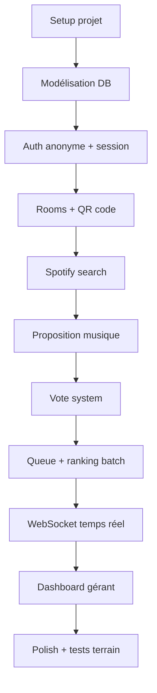
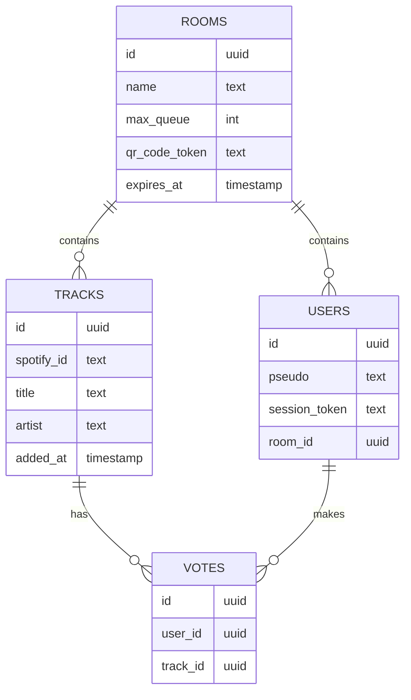
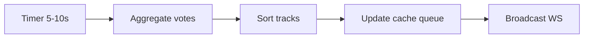
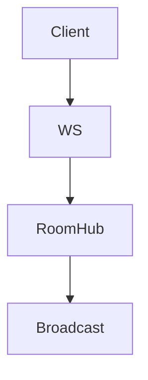

# Crowd Beats – Plan de développement MVP (Backend Go + Flutter)

## 🎯 Objectif

Livrer une V1 testable en conditions réelles (bar) avec :

* temps réel fonctionnel
* stabilité > scalabilité
* UX simple et fluide

---

# 🧭 1. Roadmap globale (ordre optimal)



---

# 🏗️ 2. Découpage en phases

## 🟢 Phase 1 — Fondations (2-3 jours)

### Objectif

Avoir un backend qui tourne + DB propre

### À faire

* Setup repo Go (Gin ou Fiber recommandé)
* Setup PostgreSQL
* Migration tool (goose ou migrate)

### Modèles DB (version simple)



---

## 🟡 Phase 2 — Auth anonyme + Room (2-3 jours)

### Objectif

Pouvoir rejoindre une room via QR code

### Features

* Génération QR code (token temporaire)
* Endpoint join room
* Création session user (token persistant)

### API

```txt
POST /rooms
POST /rooms/{token}/join
GET /me
```

### Implémentation

* session_token stocké côté client (Flutter)
* middleware auth simple

---

## 🟠 Phase 3 — Spotify integration (2 jours)

### Objectif

Rechercher musique

### Features

* OAuth Client Credentials Spotify
* endpoint search

### API

```txt
GET /search?q=
```

### Tips

* cache résultats (éviter spam API)
* limiter rate côté backend

---

## 🔵 Phase 4 — Ajout de musique (2-3 jours)

### Objectif

Proposer une track + gérer doublons

### Features

* ajout track
* détection doublon (spotify_id + room_id)

### logique

```txt
if track exists:
    return "already exists → vote"
else:
    insert track
```

---

## 🟣 Phase 5 — Voting system (3 jours)

### Objectif

Votes robustes

### Règles

* max 3-5 votes/user
* 1 vote / track / user

### DB contraintes

```sql
UNIQUE(user_id, track_id)
```

### API

```txt
POST /tracks/{id}/vote
```

---

## 🔴 Phase 6 — Queue + Ranking (3-4 jours)

### Objectif

Core du produit

### Algo

* score = COUNT(votes)
* tri DESC score
* tie → added_at ASC (FIFO)

### Batch recalcul (CRUCIAL)



### Important

* NE PAS recalculer à chaque vote
* utiliser un cache mémoire (map)

---

## 🟤 Phase 7 — WebSocket temps réel (3-4 jours)

### Objectif

Sync live

### Events

* new_track
* vote_update
* queue_update
* track_deleted

### Archi



### Implémentation Go

* goroutines + channels
* 1 hub par room

---

## ⚫ Phase 8 — Dashboard gérant (2-3 jours)

### Features

* voir queue
* delete track
* skip track

### API

```txt
DELETE /tracks/{id}
POST /tracks/{id}/skip
```

### Important

* suppression HARD (cascade votes)

---

## ⚪ Phase 9 — Front Flutter MVP (5-7 jours)

### Écrans

* Scan QR
* Pseudo input
* Search
* Queue list
* Vote UI

### Tech

* WebSocket client
* state simple (Provider ou Riverpod)

---

## 🧪 Phase 10 — Tests terrain (2-3 jours)

### Objectif

Validation réelle

### À tester

* latence votes
* stabilité WS
* UX vote

---

# 🚀 3. Priorisation des features

### 🔥 CRITIQUE

* join room
* ajouter track
* voter
* queue ranking
* websocket

### ⚠️ IMPORTANT

* limite votes
* doublons
* suppression track

### 💤 NICE TO HAVE

* stats gérant
* UI polish

---

# 🛠️ 4. Conseils d’implémentation (très pragmatique)

## Backend

* commencer MONOLITHIQUE (pas microservices)
* pas de Redis au début → mémoire Go suffit
* structurer par modules simples

```txt
/internal
  /room
  /track
  /vote
  /ws
```

## Queue

* stocker en mémoire
* recalcul batch goroutine

## WebSocket

* ne pas over-engineer
* simple pub/sub interne

## Flutter

* faire UI minimaliste
* éviter animations inutiles

---

# ⚠️ 5. Pièges à éviter

## ❌ Recalcul temps réel

→ va tuer les perfs

## ❌ WebSocket trop complexe

→ rester simple

## ❌ Spotify trop couplé

→ wrapper API

## ❌ DB sur-sollicitée

→ utiliser cache mémoire

## ❌ Multi-room complexe

→ garder logique simple par room

---

# ⏱️ 6. Estimation globale

| Phase         | Temps |
| ------------- | ----- |
| Setup         | 2-3j  |
| Auth + Room   | 2-3j  |
| Spotify       | 2j    |
| Tracks        | 2-3j  |
| Votes         | 3j    |
| Queue         | 3-4j  |
| WebSocket     | 3-4j  |
| Dashboard     | 2-3j  |
| Front Flutter | 5-7j  |
| Tests         | 2-3j  |

### 👉 TOTAL : ~25 à 30 jours (solo dev)

---

# 🧠 7. Stratégie MVP (ultra important)

### Objectif réel

👉 tester en bar, pas faire un produit parfait

### donc :

* UX > code propre
* stabilité > features
* simplicité > scalabilité

---

# 🧪 8. Plan de lancement terrain

1. 1 bar pilote
2. 1 seule room
3. 20-50 users max
4. observer comportements
5. itérer

---

# ✅ Résultat attendu

Une app capable de :

* créer une ambiance participative
* tourner toute une soirée sans crash
* être comprise en 30 secondes par un client

---

# 🔥 Next step après MVP

* autoplay
* recommandations
* gamification
* scaling infra

---
